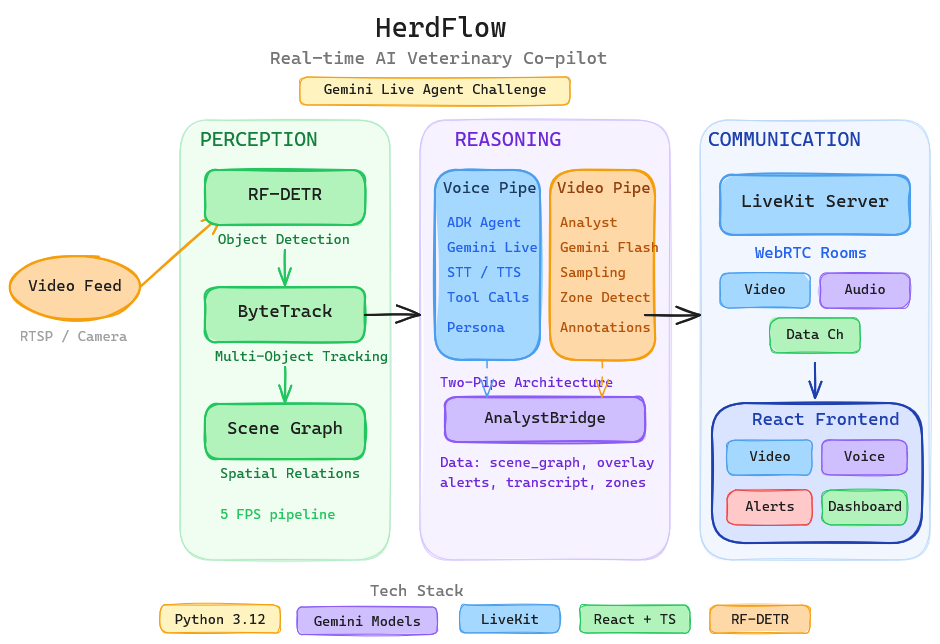

<p align="center">

```
 ██╗  ██╗███████╗██████╗ ██████╗ ███████╗██╗      ██████╗ ██╗    ██╗
 ██║  ██║██╔════╝██╔══██╗██╔══██╗██╔════╝██║     ██╔═══██╗██║    ██║
 ███████║█████╗  ██████╔╝██║  ██║█████╗  ██║     ██║   ██║██║ █╗ ██║
 ██╔══██║██╔══╝  ██╔══██╗██║  ██║██╔══╝  ██║     ██║   ██║██║███╗██║
 ██║  ██║███████╗██║  ██║██████╔╝██║     ███████╗╚██████╔╝╚███╔███╔╝
 ╚═╝  ╚═╝╚══════╝╚═╝  ╚═╝╚═════╝ ╚═╝     ╚══════╝ ╚═════╝  ╚══╝╚══╝
```

</p>

<p align="center">
  <strong>Real-time AI Veterinary Co-pilot for Livestock Monitoring</strong>
</p>

<p align="center">
  <em>Talk to your herd. See what the camera sees. Get alerts before problems become emergencies.</em>
</p>

<p align="center">
  <a href="#quickstart">Quickstart</a> &bull;
  <a href="#architecture">Architecture</a> &bull;
  <a href="#features">Features</a> &bull;
  <a href="#google-cloud-apis">Google Cloud APIs</a> &bull;
  <a href="#deployment">Deployment</a>
</p>

<p align="center">
  
  
  
  
  
  
  
</p>

---

> **Gemini Live Agent Challenge** — *Live Agents Category*
>
> **Team:** OhboyConsultancy FZ LLC
>
> HerdFlow is a voice-first AI assistant that watches a livestock camera feed, tracks individual animals in real-time, and converses with farmers using natural speech. Ask it "how's cow 3 doing?" and it answers from live scene data.

---

## Demo

<!-- Replace with actual demo video link after recording -->

https://github.com/user-attachments/assets/placeholder

## Architecture

<p align="center">
  
</p>

HerdFlow runs as **two independent processes** connected via LiveKit data channels:

```
                          ┌─────────────────────────────────┐
                          │        LIVEKIT SERVER            │
                          │     WebRTC Rooms + Data Ch       │
                          └──────────┬──────────────────────┘
                                     │
                    ┌────────────────┼────────────────┐
                    │                │                │
                    ▼                ▼                ▼
          ┌─────────────┐  ┌─────────────┐  ┌──────────────┐
          │ VOICE PIPE   │  │ VIDEO PIPE   │  │   REACT      │
          │              │  │              │  │  FRONTEND    │
          │ ADK Agent    │  │ RF-DETR      │  │              │
          │ Gemini Live  │  │ ByteTrack    │  │ Video Panel  │
          │ Native Audio │  │ Scene Graph  │  │ Voice Panel  │
          │ Google STT   │  │ Gemini Flash │  │ Alert Panel  │
          │ Tool Calls   │  │ Annotations  │  │ Dashboard    │
          └──────┬───────┘  └──────┬───────┘  └──────────────┘
                 │                 │
                 │   AnalystBridge │
                 └────────────────┘
                   Data Channels
```

### Three Tiers

| Tier | Role | Tech | Latency |
|------|------|------|---------|
| **Perception** | Detect + track animals, build scene graph | RF-DETR, ByteTrack, supervision | ~5 FPS |
| **Reasoning** | Voice conversation + visual analysis | Gemini 2.5 Flash Live, Gemini 3 Flash, ADK | <1s voice, 30s summaries |
| **Communication** | WebRTC transport to browser | LiveKit Agents, React, Tailwind | Real-time |

## Features

**Voice Interaction**
- Natural speech with Gemini 2.5 Flash Native Audio (bidirectional streaming)
- Farmer asks questions, agent responds with synthesized speech
- Google STT for async transcription + conversation memory
- Session rotation every 8 min (avoids Gemini Live 10-min limit)

**Computer Vision**
- RF-DETR object detection with ByteTrack multi-object tracking
- Scene graph with per-animal identity: position, behavior, zone, velocity
- Gemini 3 Flash vision for rich annotations (color, posture, health notes)
- Automatic zone detection (feed area, water trough, resting area)

**Smart Alerts**
- Prolonged lying detection (configurable threshold)
- Isolation scoring (animals far from herd)
- Missed feeding alerts
- Zone occupancy tracking

**Tool Calling**
- `search_entity_history` — behavior timeline for specific animals
- `get_herd_stats` — aggregate herd statistics
- `find_by_description` — "the brown cow near the fence"
- `get_zone_history` — who visited which zone and when
- `get_scene_summary` — what the camera currently shows
- `analyze_frame` — deep visual analysis on demand

## Quickstart

### Prerequisites

- Python 3.12+
- Node.js 20+
- [uv](https://docs.astral.sh/uv/) (Python package manager)
- A [Google API key](https://aistudio.google.com/apikey) with Gemini access
- A [LiveKit server](https://docs.livekit.io/home/self-hosting/local/) (local or cloud)

### 1. Clone and configure

```bash
git clone https://github.com/AravindAkuthota/herdflow.git
cd herdflow
cp .env.example .env
# Edit .env — set GOOGLE_API_KEY, LIVEKIT_URL, LIVEKIT_API_KEY, LIVEKIT_API_SECRET
```

### 2. Install dependencies

```bash
# Backend
uv sync

# Frontend
cd frontend && npm install && cd ..
```

### 3. Run

```bash
# Terminal 1 — Video process (perception + Gemini vision)
uv run python -m agent.video_agent dev

# Terminal 2 — Voice process (ADK + Gemini Live audio)
uv run python -m agent.voice_agent dev

# Terminal 3 — Frontend
cd frontend && npm run dev
```

Open `http://localhost:5173`, join the room, and start talking to HerdFlow.

### One-command launch

```bash
# Launches both agents in a single process
uv run python -m agent.main dev
```

## Google Cloud APIs

HerdFlow uses **7 Google Cloud services**. Full proof with code snippets and live API logs: [`docs/gcp_deployment_proof.md`](docs/gcp_deployment_proof.md)

| Service | Model / Package | Purpose |
|---------|----------------|---------|
| **Gemini 2.5 Flash Native Audio** | `gemini-2.5-flash-native-audio-preview` | Real-time voice agent (Live API) |
| **Gemini 3 Flash** | `gemini-3-flash-preview` | Background scene summaries + entity annotation |
| **Gemini 3 Pro** | `gemini-3-pro-preview` | On-demand deep visual analysis |
| **Google ADK** | `google.adk` | Agent lifecycle, Runner, LiveRequestQueue |
| **Google GenAI SDK** | `google.genai` | Content types, model API calls |
| **Google Cloud STT** | `livekit.plugins.google.STT` | Async speech transcription |
| **Cloud Build** | `cloudbuild.yaml` | Docker build + GCR push |

## Project Structure

```
herdflow/
├── agent/
│   ├── main.py                     # Thin launcher — spawns voice + video
│   ├── voice_agent.py              # Voice process: ADK + Gemini Live + STT
│   ├── video_agent.py              # Video process: RF-DETR + Gemini Flash
│   ├── adk_agents.py               # Tool functions + agent scaffold
│   ├── config.py                   # Pydantic settings from .env
│   ├── models.py                   # 24 Pydantic data models
│   ├── perception/
│   │   ├── detector.py             # RF-DETR wrapper
│   │   ├── tracker.py              # ByteTrack via supervision
│   │   ├── scene_graph.py          # Scene graph builder
│   │   └── video_source.py         # File/RTSP video source
│   ├── reasoning/
│   │   ├── video_analyst.py        # Gemini Flash/Pro frame analysis
│   │   ├── analyst_bridge.py       # Cross-pipe data relay
│   │   ├── memory.py               # Conversation context stuffing
│   │   ├── prompts.py              # Veterinarian persona prompt
│   │   └── tools.py                # Tool definitions
│   ├── alerts/
│   │   └── rules.py                # Alert rule engine
│   └── storage/
│       └── history.py              # SQLite tracking history
├── frontend/
│   ├── src/
│   │   ├── App.tsx                 # 70/30 split layout
│   │   ├── components/
│   │   │   ├── VideoPanel.tsx      # Annotated video with overlay boxes
│   │   │   ├── VoicePanel.tsx      # Voice UI + transcript
│   │   │   ├── AlertPanel.tsx      # Alert cards
│   │   │   └── Dashboard.tsx       # Herd summary metrics
│   │   └── hooks/                  # useSceneGraph, useOverlay, useAlerts...
│   └── package.json
├── tests/                          # 133 backend tests
├── docs/
│   ├── architecture.png            # Architecture diagram
│   └── gcp_deployment_proof.md     # Google Cloud API usage proof
├── scripts/                        # e2e.py, download_video.py, etc.
├── Dockerfile                      # Multi-stage: Node 20 + CUDA 12.4
├── cloudbuild.yaml                 # Google Cloud Build pipeline
├── docker-compose.yml
├── pyproject.toml
└── .env.example
```

## Testing

```bash
# Run all 133 tests
uv run pytest

# Single test
uv run pytest tests/test_scene_graph.py -k test_isolation

# Lint + typecheck
uv run ruff check . && uv run pyright

# Frontend
cd frontend && npx vitest run && npx tsc --noEmit
```

## Deployment

### Docker (local)

```bash
docker compose up --build
```

### Google Cloud Run (GPU)

```bash
# Build and push via Cloud Build
gcloud builds submit --config cloudbuild.yaml

# Deploy to Cloud Run with GPU
gcloud run deploy herdflow-agent \
  --image gcr.io/$PROJECT_ID/herdflow-agent \
  --gpu 1 --gpu-type nvidia-l4 \
  --memory 8Gi --cpu 4 \
  --set-env-vars "GOOGLE_API_KEY=$GOOGLE_API_KEY"
```

## Configuration

All settings are in `.env` (see `.env.example`):

| Variable | Default | Description |
|----------|---------|-------------|
| `GOOGLE_API_KEY` | — | Google AI API key (required) |
| `LIVEKIT_URL` | `ws://localhost:7880` | LiveKit server URL |
| `LIVEKIT_API_KEY` | `devkey` | LiveKit API key |
| `LIVEKIT_API_SECRET` | `secret` | LiveKit API secret |
| `GEMINI_MODEL` | `gemini-3-flash-preview` | Default Gemini model |
| `MAX_FPS` | `2.0` | Perception pipeline frame rate |
| `RFDETR_DETECTION_THRESHOLD` | `0.3` | Detection confidence threshold |

## Tech Stack

```
 ╔════════════════════╗  ╔════════════════════╗  ╔════════════════════╗
 ║   Python 3.12      ║  ║  Gemini Models     ║  ║   LiveKit          ║
 ║   uv, asyncio      ║  ║  2.5 Flash Audio   ║  ║   WebRTC Rooms     ║
 ║   Pydantic v2      ║  ║  3 Flash Vision    ║  ║   Agents Framework ║
 ╚════════════════════╝  ║  3 Pro Analysis    ║  ╚════════════════════╝
 ╔════════════════════╗  ╚════════════════════╝  ╔════════════════════╗
 ║   React + TS       ║  ╔════════════════════╗  ║   RF-DETR          ║
 ║   Vite, Tailwind   ║  ║  Google ADK        ║  ║   ByteTrack        ║
 ║   LiveKit SDK      ║  ║  Agent Framework   ║  ║   supervision      ║
 ╚════════════════════╝  ╚════════════════════╝  ╚════════════════════╝
```

## VisionFlow Platform Vision

HerdFlow is an instance of the **VisionFlow** pattern — a domain-agnostic architecture for real-time visual monitoring with AI reasoning. The same three-tier architecture (Perception → Reasoning → Communication) can be adapted to:
- Construction site safety monitoring
- Warehouse operations tracking
- Wildlife conservation surveillance
- Manufacturing quality inspection

Domain-specific code is isolated in configuration, prompts, and alert rules.

## License

MIT

---

<p align="center">
  Built for the <a href="https://ai.google.dev/competition/projects/live-agents">Gemini Live Agent Challenge</a>
</p>
